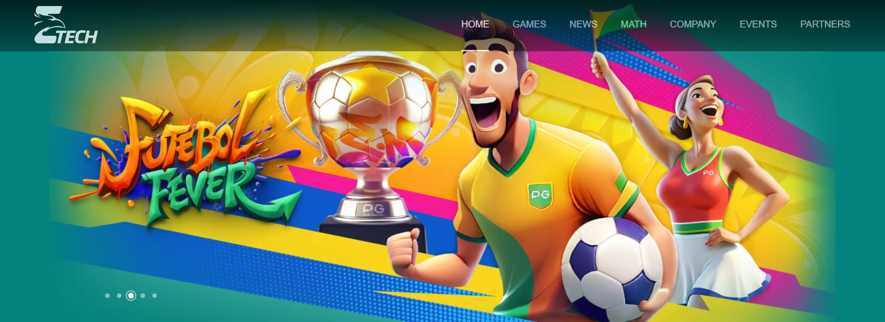
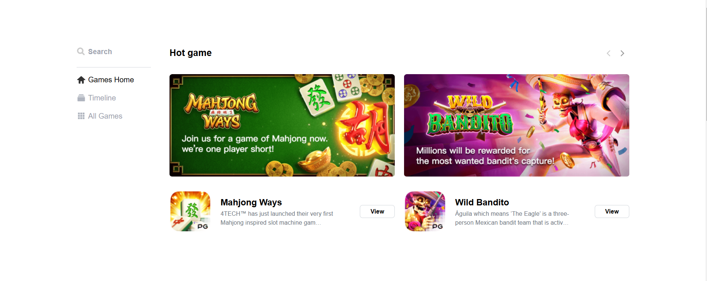
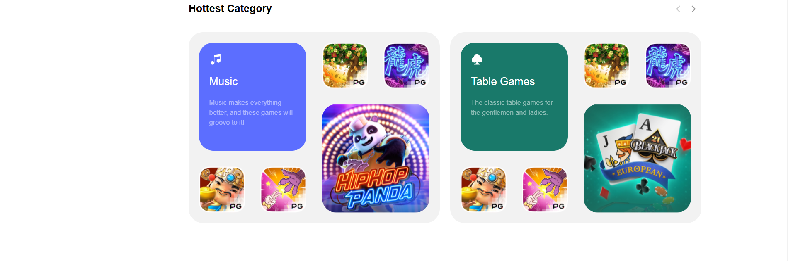
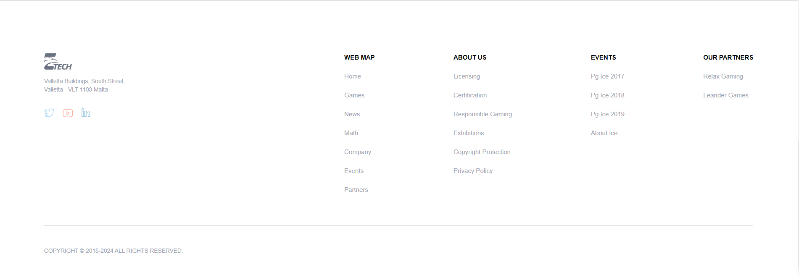
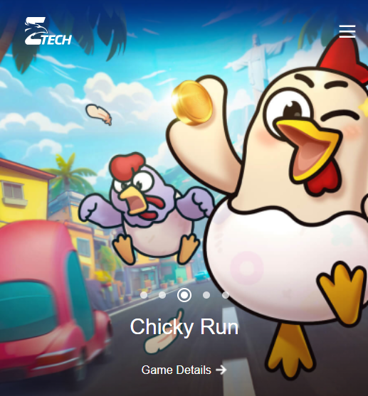
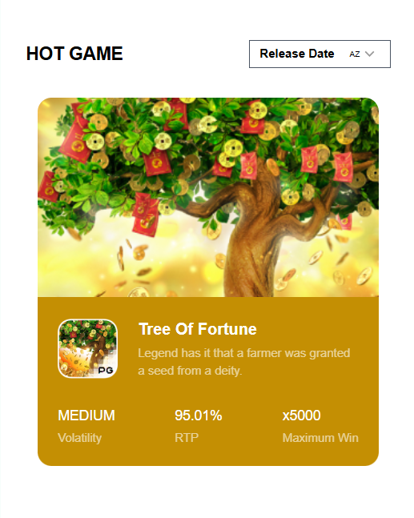

# NEVEL TECH

[Design](https://www.figma.com/design/hmpcx7ExksgznDanSeShZq/Ba%CC%80i-test?node-id=2-7&node-type=canvas&t=Cp0ZbtTDWNI2TWMU-0)
[link Web Demo](https://nevel-tech-test-ui.vercel.app/)

## TIMELINE:

- 1.3 days

## TECHNICAL

- REACT
- TYPESCRIPT
- TAILWIND
- REACT ROUTER DOM

## CLONE

Open the terminal at the directory you want to install
git clone [git](https://github.com/Mannj-nef/NevelTech_test-UI.git)

## INSTALLATION

Dillinger requires [Node.js](https://nodejs.org/) v10+ to run.
Install the dependencies and devDependencies and start the server.

```sh
cd NevelTech
npm i
npm run dev
Open on web: http://localhost:3333
```

## IMAGE DEMO

### Laptop






### Mobile





